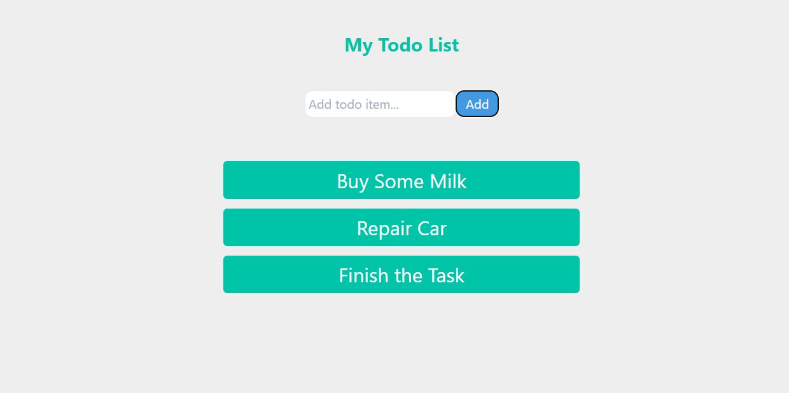
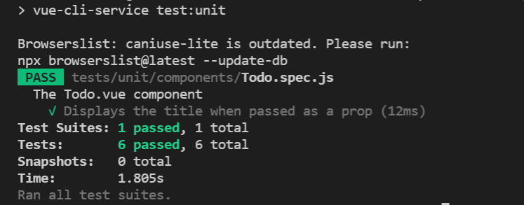
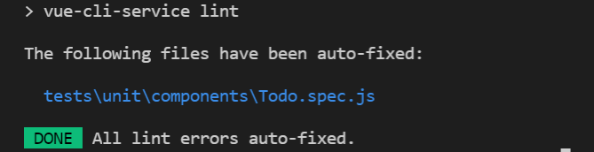

# ToDo Application (Vue-Django)

## To Do List

- [x] 1- User interface for ONLY adding ToDo’s
- [x] 2- Back-end service to store of ToDo item
- [x] 3- Writing deployment files front-end and back-end
- [x] 4- Dockerize both your front-end and back-end application to make them ready for deployment.



## Tech Stack

<ol>
<li>Django (backend)
    <ol>
        <li>Django (web framework)</li>
        <li>db.sqlite3 (database)</li>
    </ol>
</li>

<li> Vue (frontend) 
    <ol>
        <li>axios (API calls)</li>
        <li>unit tests (vue-test-utils)</li>
    </ol>
</li>

## Directory Structure
```
.
├── Dockerfile // Dockerfile backend
├── controllers // Backend APIs
├── docker-compose.yml 
├── frontend
│   ├── Dockerfile // Dockerfile frontend
│   ├── src
│   ├────── App.vue // App Todo UI
│   ├────── axios-api.js // Axios API Calls
│   └── main.js
│   ├── tests
│   ├────── e2e
│   └────── unit


```

## Architecture Decision

1. I created three dockerfile Dockerfile for frontend.

```
    FROM node:14-alpine3.14

    COPY ./vuengo /frontend

    RUN npm install -g http-server

    WORKDIR /frontend

    RUN npm install

    RUN npm rebuild node-sass

    RUN npm run build

    EXPOSE 8080
    CMD [ "http-server", "dist" ]
```
2. I created three dockerfile Dockerfile for frontend.
 
```
    FROM python:3.10-alpine3.15

    RUN pip install --upgrade pip

    RUN adduser --disabled-password --gecos '' myuser

    COPY ./vuengo/requirements.txt .
    RUN pip install -r requirements.txt

    COPY ./vuengo /app

    WORKDIR /app

    COPY ./entrypoint.sh /

    ENTRYPOINT ["sh", "/entrypoint.sh"]
```

#### APIs

`[POST]`

`$ curl --location --request POST '127.0.0.1:8000/tasks/' --header 'Content-Type: application/json' --data-raw '{ "description": "Buy Some Milk" }'`

`[GET]`

`$ curl --location --request GET '127.0.0.1:8000/tasks/'`


For the frontend development server you can run 

`$ npm run serve` 

it runs **:8080**

For Unit tests:

`$ npm run test:unit`


    
For Lint:

`$ npm run lint`
    


### With Docker compose

`$ docker-compose up --build -d`  
